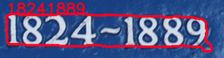
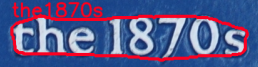

# OCR Recognition




Train Transformer/Sequential text recognition models in PyTorch.

## Installation

Requirements:
* albumentations==1.1.0
* numpy==1.19.5
* opencv-python==4.5.5.62
* PyYAML==6.0
* torch==1.10.2
* tqdm==4.62.3
* git+https://github.com/KonstantinDob/gyomei_trainer.git

From pip:
```
python -m build
pip install dist/ocr_recognition-1.1.0-py3-none-any.whl
```

From source:
```
pip install -U git+https://github.com/KonstantinDob/ocr_recognition
```

## Run

[CTW1500](https://ctwdataset.github.io/) dataset and synthetic MNIST
was used for training.

To train/test/make prediction you should run scripts from ./bin 
directory. Note! Before running scripts check paths in configs, if path 
is incorrect you will get errors.

All training runs are saved in the ./experiment folder. In experiment 
run you will find logs, best/last model weight, tensorboard data and 
configs for this training session.

For more detail about creating experiment folder, model and trainer 
formats you may visit Gyomei repo: 
https://github.com/KonstantinDob/gyomei_trainer .

## Docker 

To use docker with GPU you need *nvidia-docker == 2.9.0*.

Build project:

```
make build
```

Run in interactive mode:

```
make run
```

Run train without interactive mode:

```
make train
```
